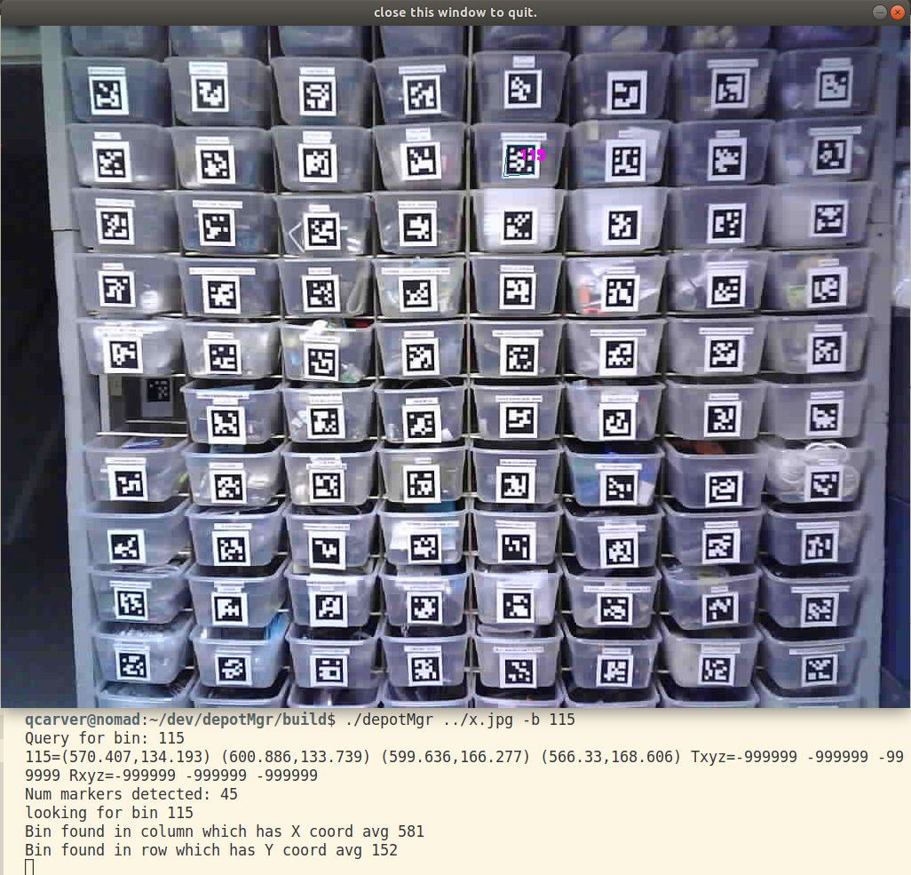

# depotMgr
Uses Aruco Fiducials to Identify location of depot bins

to use:
1) Aruco requires OpenCV (I used 4.5.2), so install OpenCV: https://riptutorial.com/opencv/example/15781/build-and-install-opencv-from-source
2) depotMgr was built w/ Aruco 3.1.9, so install Aruco: http://www.uco.es/
3) inside depotMgr folder mkdir bin
4) cd bin
5) cmake ../
6) make
7) ./depotMgr ../x.jpg ../arucoConfig.yml

Notes:
1) arucoConfig.yml is a configuration file to improve results. You should make your own, see aruco site for details
2) There is no two.

Use-case:
1) Enter a bin number or an item to search for
2) Return the picture of shelves w a box drawn around the bin of interest

Demo:

TODO:
1) Problem w/ storing Bins as objects is that there will be two of them on for Column, one for Row
2) Suggest Storing Marker references in Rows and Columns instead of Bin objects
3) Keep a vector of Bin objects else where which also has a Marker reference